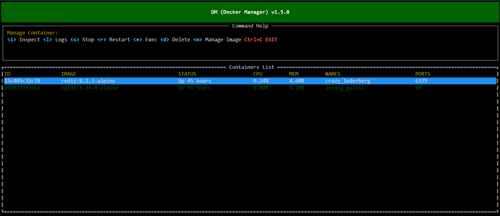

# Docker Manager (DM)

A terminal-based Docker management tool providing an intuitive TUI interface for managing Docker containers and images.



## Features

### Container Management
- 📋 View all containers (running + stopped)
- 📊 Real-time monitoring of container CPU and memory usage
- 🔍 View container details (inspect)
- 📜 View container logs
- ▶️ Start/Stop containers
- 🗑️ Delete containers
- 💻 Execute commands inside containers (exec)

### Image Management
- 🖼️ View all images
- 🏷️ Tag images
- 🗑️ Delete images

### Interface Features
- 🎨 Colorful terminal interface
- ⌨️ Full keyboard shortcut support
- 🔄 Auto-refresh (2-second interval)
- 📱 Responsive layout

## Installation

### Prerequisites
- Go 1.21 or higher
- Docker service running
- Current user has permission to access Docker (or run with sudo)

### Install from Source

```bash
# Clone the repository
git clone https://github.com/yourusername/docker-manager.git
cd docker-manager

# Build
go build -o dm ./cmd/docker-manager

# Run
./dm
